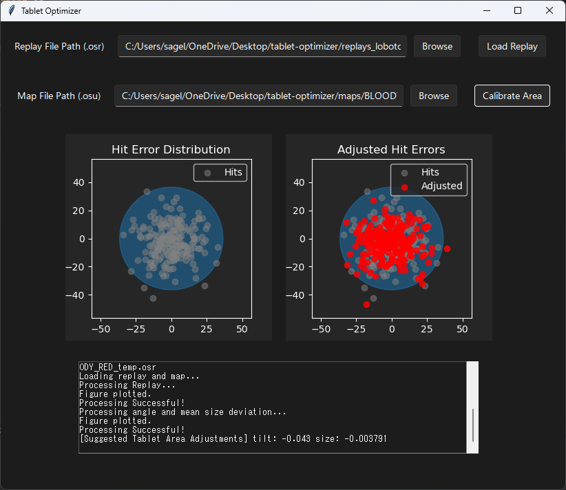

# osu! Tablet Area Optimizer

An app to analyze hit errors in a map and provide recommended tilt and size adjustments.

# Methodology:

For each object in a map, an algorithm is used to determine the attempt made by the player to hit the object and a correspondance is built accordingly. We take each pair in this correspondance and find the signed angle between the vector from the center of the playfield to the object, and the vector from the center of the playfield to the hit attempt, and record. For size adjustments, we simply record the ratio of the magnitude of these two vectors for each action-object pair. There are two calibration methods currently supported:

* A simple mean of the angle and size deviations.
* A least-squares fit minimizing hit error with angle and size adjustment as parameters.

Size and tilt suggested adjustments are then returned to the user, and the modifications plotted for visualization.

Current bugs/ limitations:

* Only works with k1, k2 playstyle (no mouse clicks).
* Possible errors when reading maps with breaks at the start.
